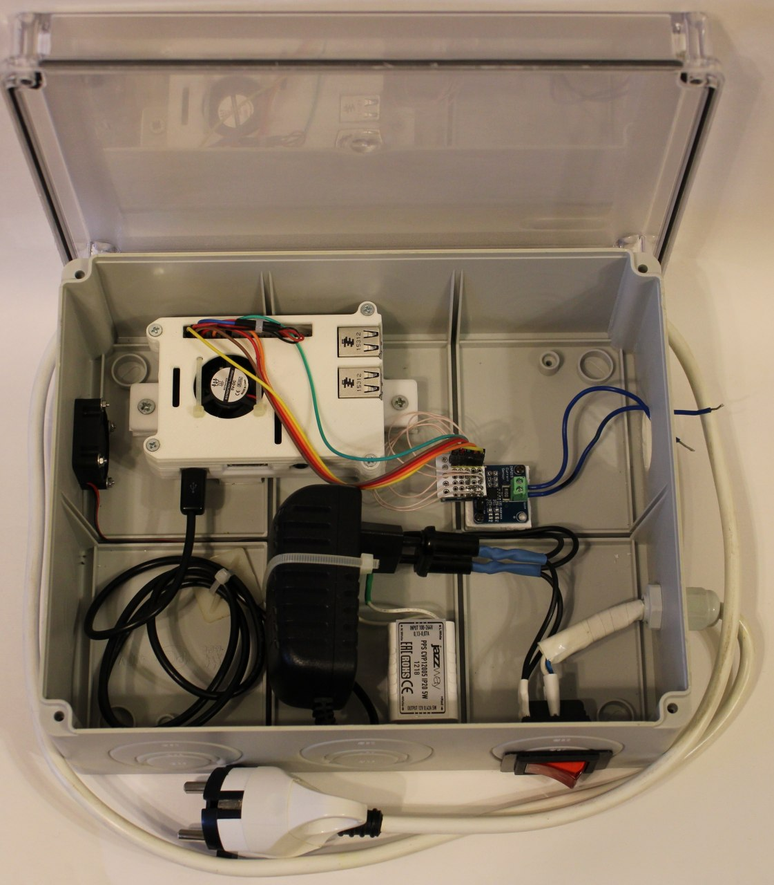
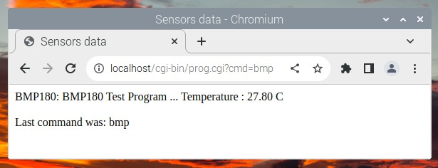
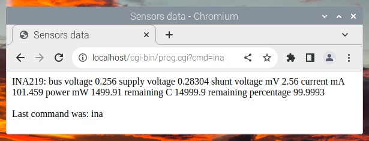

# RaspberryPiCgiccTemplate

## Cgicc application performing HTTP requests to poll Arduino/Raspberry PI sensors
## Test device view



## Additional devices

- BMP180 input (pressure and temperature)
- INA219 input (current shunt and power monitor)

## Features


- Get temperature


- get INA data

## Project goal

Design a application layer between "low-level" sensor polling and "high-level" logic

## Tech

- [BMP180](www.osoyoo.com)

- [INA219](https://github.com/regisin/ina219)

## Requirements

STM32CubeIDE 1.11.0 or higher
WiringPi
Appache2

## Installation

- Build a BMP180 cgi application and place it in: /usr/lib/cgi-bin

```bash
cd bmp180-c;
sudo gcc -Wall -o bmp180 bmp180.c -lwiringPi -lm;
cd build;
sudo chown root bmp.cgi;
sudo chmod +s bmp.cgi;
sudo cp bmp.cgi  /usr/lib/cgi-bin;
```
- Build a INA219 cgi application and place it in: /usr/lib/cgi-bin

```bash
cd ina219;
make;
cd build;
sudo chown root ina.cgi;
sudo chmod +s ina.cgi;
sudo cp ina.cgi  /usr/lib/cgi-bin;
```

- Build a main cgi application and place it in: /usr/lib/cgi-bin

```bash
g++ -o prog.cgi RPiCgicc.cpp -lcgicc;
cd build;
chmod 755 prog.cgi;
sudo cp prog.cgi /usr/lib/cgi-bin
```

- Start Appache

```bash
sudo a2enmod cgid;
systemctl start apache2; 
systemctl status apache2;
```

- Web access

```
http://localhost/cgi-bin/prog.cgi?cmd=bmp
```

